# 🚀 Production Linux Server Setup


A production-ready Ubuntu Linux Server project demonstrating **Linux Administration, Server Hardening, Docker, Nginx, Bash Scripting, Monitoring, Backup Automation, Log Rotation, and System Services**.

---

# 📌 Project Overview

This project simulates the setup and administration of a production Ubuntu Linux server from scratch.

It focuses on practical system administration tasks that are commonly performed by Linux, Cloud, DevOps, and Site Reliability Engineers.

## Project Objectives

- Configure a production-ready Linux server
- Secure remote SSH access
- Deploy an Nginx web server
- Run containers using Docker & Docker Compose
- Configure systemd services
- Automate backups with Cron
- Rotate logs using Logrotate
- Build reusable Bash monitoring scripts
- Practice Git & GitHub workflow

---

# ✨ Features

- ✅ Ubuntu Server Administration
- ✅ Linux File Permissions
- ✅ User & Group Management
- ✅ SSH Configuration
- ✅ UFW Firewall
- ✅ Fail2Ban
- ✅ Docker
- ✅ Docker Compose
- ✅ Nginx
- ✅ systemd
- ✅ Cron Jobs
- ✅ Bash Scripting
- ✅ Logrotate
- ✅ Monitoring Scripts
- ✅ Automated Backups

- ---

# 🏗️ Architecture

The following diagram illustrates the overall architecture of the production Linux server.

<p align="center">
  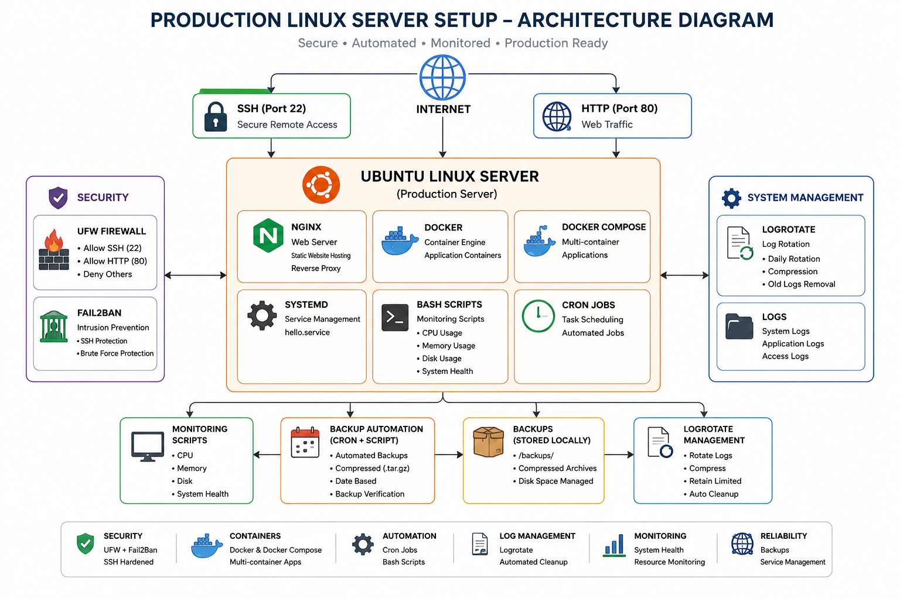
</p>
                  
# 📂 Project Structure

```text
production-linux-server-setup/
├── architecture/
├── assets/
├── cron/
├── docker/
├── docs/
├── logrotate/
├── nginx/
├── screenshots/
├── scripts/
├── ssh/
├── systemd/
└── README.md
```

---

# ⚙️ Technologies Used

| Category | Technologies |
|----------|--------------|
| Operating System | Ubuntu Linux 22.04 |
| Web Server | Nginx |
| Containers | Docker, Docker Compose |
| Scripting | Bash |
| Automation | Cron |
| Service Management | systemd |
| Log Management | Logrotate |
| Security | UFW, Fail2Ban |
| Version Control | Git & GitHub |

---

# 🔒 Security Hardening

This project includes:

- SSH configuration
- User and group management
- Linux file permissions
- UFW firewall
- Fail2Ban intrusion prevention
- Service management with systemd

---

# 🐳 Docker & Docker Compose

Implemented:

- Docker installation
- Docker Compose
- Multi-container deployment
- Docker networking
- Persistent volumes

---

# 🌐 Nginx

Configured:

- Custom Virtual Host
- Static website hosting
- Configuration testing
- Local HTTP validation

---

# ⚙️ systemd

Created a custom service:

- hello.service

Demonstrated:

- Start service
- Stop service
- Enable service
- View logs using journalctl

---

# 📊 Monitoring Scripts

Custom Bash scripts monitor:

- CPU Usage
- Memory Usage
- Disk Usage
- Overall System Health

---

# 💾 Backup Automation

Implemented:

- Backup Bash script
- Cron scheduling
- Compressed archives
- Backup verification

---

# 📄 Log Rotation

Configured using Logrotate:

- Daily rotation
- Compression
- Automatic cleanup
- File retention policy

---

# 📷 Screenshots

Screenshots demonstrating the project are stored in the `screenshots/` directory.

Examples include:

- Linux Server
- Docker
- Docker Compose
- Nginx
- UFW
- Fail2Ban
- Monitoring
- Backup
- Logrotate
- systemd

---

# 🧠 Skills Demonstrated

- Linux Administration
- Bash Scripting
- Docker
- Docker Compose
- Nginx
- Git
- GitHub
- SSH
- UFW
- Fail2Ban
- systemd
- Cron Jobs
- Logrotate
- Monitoring & Automation

---

# 🚀 Future Improvements

- HTTPS using Let's Encrypt
- GitHub Actions CI/CD
- Terraform Infrastructure
- Kubernetes Deployment
- Prometheus Monitoring
- Grafana Dashboard
- Ansible Automation

---

---

# 📸 Project Screenshots

## 1. Server Information

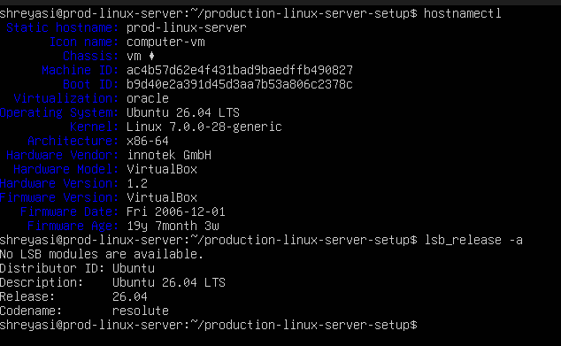

---

## 2. Nginx Web Server

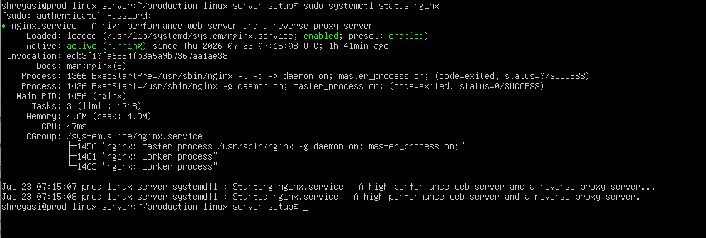

---

## 3. Docker

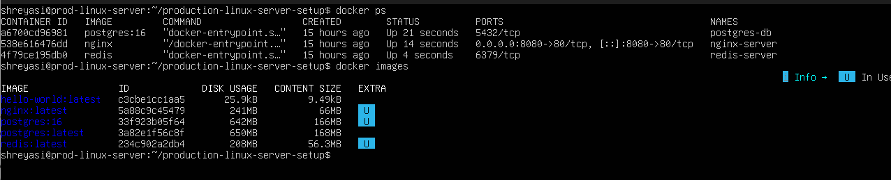

---

## 4. Docker Compose

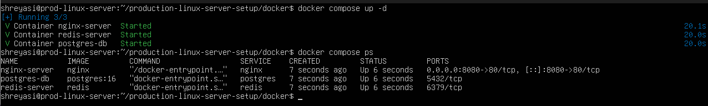

---

## 5. Systemd Service

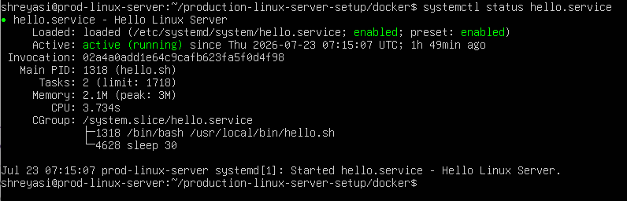

---

## 6. UFW Firewall

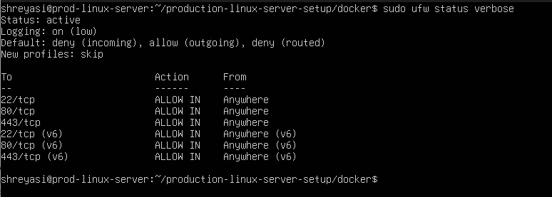

---

## 7. Fail2Ban

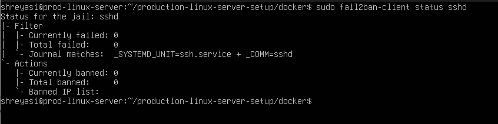

---

## 8. Automated Backup

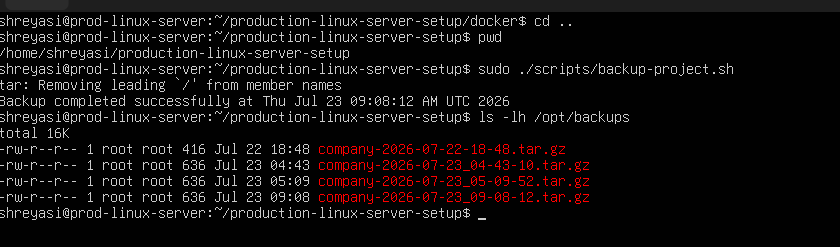

---

## 9. Backup Script

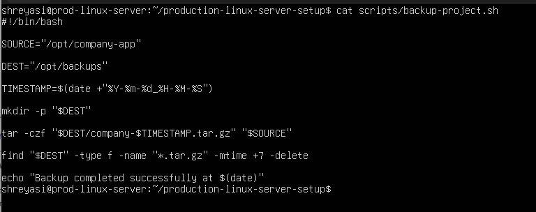

---

## 10. Monitoring Scripts

.png)

.png)

---

## 11. Logrotate

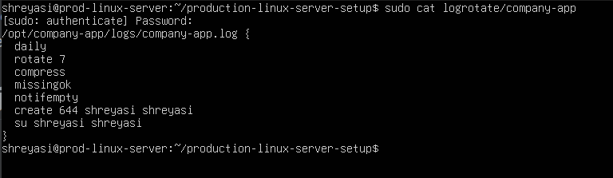

---

## 12. Running Services

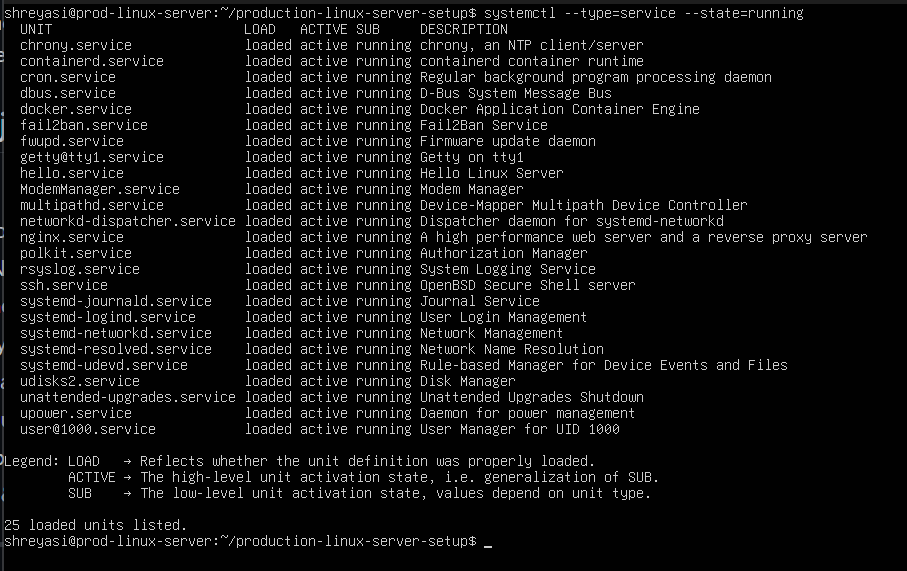

# 👩‍💻 Author

**Shreyasi Sen**

GitHub: https://github.com/senshrey-95
